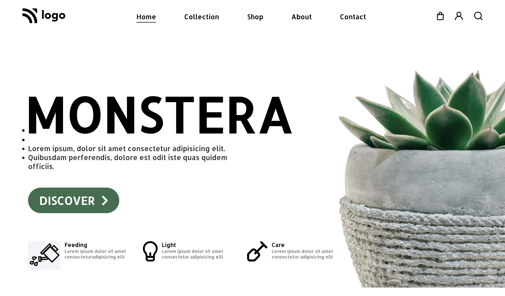

# Project 6 - HTML and CSS

By Pooja Patil

Here's the Live Deployed Website ![Project 6]

## [DEPLOYED WEBSITE LINK](https://monstera-p.netlify.app/)

## What I learned from this Project?

- I learned about **layout** making through **Flexbox**.
- I also learned how to use **Icons**.
- I also learned how to design **Cards**.
- I also learned how to use **Icons in the Button**.

## This project took around **7 hours** to complete.
